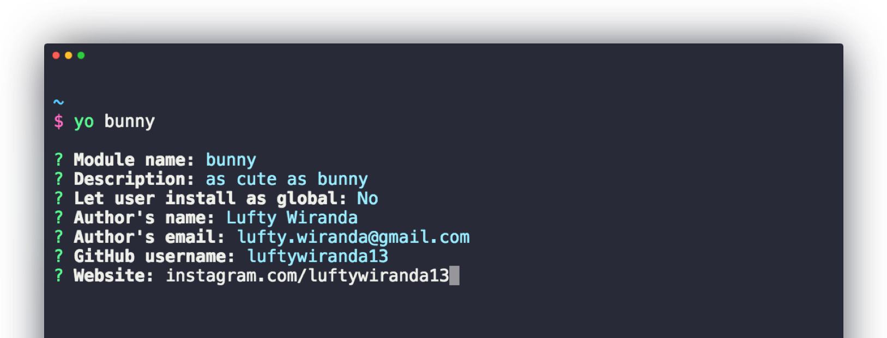

<p align="center">
  
</p>

<p align="center">
  <strong>Jumpstart <a href="https://nodejs.org/api/modules.html#modules_modules">node module</a>, like a bunny!</strong>
</p>

<p align="center">
  <a href="https://www.npmjs.com/package/generator-bunny">
    
  </a>
  <a href="https://travis-ci.org/luftywiranda13/generator-bunny">
    
  </a>
  <a href="https://codecov.io/github/luftywiranda13/generator-bunny">
    
  </a>
  <a href="https://david-dm.org/luftywiranda13/generator-bunny">
    
  </a>
  <a href="https://github.com/prettier/prettier">
    
  </a>
  <a href="https://github.com/luftywiranda13/generator-bunny/blob/master/license">
    
  </a>
</p>
<p align="center">
  <a href="https://github.com/semantic-release/semantic-release">
    
  </a>
  <a href="http://commitizen.github.io/cz-cli">
    
  </a>
  <a href="http://makeapullrequest.com">
    
  </a>
  <a href="https://github.com/luftywiranda13/generator-bunny/blob/master/other/code_of_conduct.md">
    
  </a>
  <a href="https://github.com/luftywiranda13/generator-bunny/blob/master/other/roadmap.md">
    
  </a>
  <a href="https://github.com/luftywiranda13/generator-bunny/blob/master/other/examples.md">
    
  </a>
</p>

<p align="center">
  Don't let yourself for always having to setup any <a href="https://www.npmjs.com/">node module</a> or <a href="https://en.wikipedia.org/wiki/Open-source_software">open-source</a> projects from scratch.<br />
  Spend your time more on writing codes than setting them up.
</p>

<p align="center"><strong>Set it once, then forget it!</strong></p>

---

[](https://greenkeeper.io/)


## Highlights
This generator includes built-in modern tools which are widely-used in the community:
- [Automated GitHub release notes generator](/releases)
- [Automated releasing with semantic-release][semantic-link]
- [Automated testing & validation before any commits][husky-link]
- [Automated source-code formatting with prettier][prettier-link]
- [Babel transpiler for writing next generation JavaScript][babel-link]
- [Eslint linting utility][eslint-link]
- [Flow static typechecker][flow-link]
- [Jest test runner][jest-link]
- [Travis Continuous Integration][travis-link]
- :rabbit: [See more…](./package.json)




## Getting started


### 1. Installation

```sh
# with yarn:
yarn global add yo
yarn global add generator-bunny

# or with npm: 
npm install -g yo
npm install -g generator-bunny
```

**Note:** [Yarn][yarn-link] is faster, trust me!

### 2. Create new project

#### Make a new directory:
```sh
mkdir my-bunny
cd my-bunny
```

#### Generate files:
```sh
yo bunny

# answer some details about your project
```

#### Validate the project:
```sh
# with yarn:
yarn start validate

# or with npm:
npm start validate
```


## Usage

### 1. First-timer

#### Install and setup [semantic-release][semantic-link]:
```sh
# with yarn:
yarn global add semantic-release-cli

# or with npm:
npm i -g semantic-release-cli

# then run:
semantic-release-cli setup
```
*Make sure you already have your repository up on GitHub before, otherwise [semantic-release][semantic-link] will complaint!*

#### Select Travis CI, answer `no` to `overwrite`
There's already a general purpose [Travis CI][travis-link] configuration stored in [`.travis.yml`](./app/templates/_travis.yml). You can just leave it like that because it's already more than enough in most common situation.

#### Publish manually:
```sh
npm publish
```


### 2. Recommended workflow

#### Make changes then commit: 
```sh
# with yarn:
yarn start commit 

# or with npm:
npm start commit
```

#### Select the type of commit
This project follows the [AngularJS Commit Message Conventions][angular-conventions-link]. Following a standardized commit message format is important if you want to start a maintainable and scalable project. Also it is required to generate changelog and make automated releasing works.


#### Push those changes to GitHub
```sh
git push -origin master
```

Don't add tag, publish, or bump your project version manually. [Semantic-release][semantic-link] will do those stuffs for you.<br />
Your release version number is auto-formatted based on [SemVer specifications][semver-link].


### 3. Your own workflow

You don't need to follow those recommended steps. Define your own workflow if you will.<br />
But one of the consequence is you don't get the ability to publish/release your package to [npm][npm-link] automatically.

For example, you still can do it like this:
```sh
git add .
git commit -m "I want to do it my way cause this is my project and I'm working for myself"
```


## Tips

Some useful scripts are provided by [nps][nps-link] to help you maintain your project. To see the list, run:
```sh
# with yarn:
yarn start

# or with npm:
npm start
```


## Suggestions

Help things to get better, contributions of any kind are welcome!

Please check [`roadmap.md`][roadmap-link] to list or see something you can contribute on, then [make a pull request][prs-link] of it!<br />
Also see [`contributing.md`](./contributing.md) for more informations about how to contribute.


## Contributors

This project follows the [all-contributors][all-contributors-link] specification.<br />
Thanks goes to these people:

<!-- ALL-CONTRIBUTORS-LIST:START - Do not remove or modify this section -->
| [<br /><sub>Lufty Wiranda</sub>](https://www.instagram.com/luftywiranda13)<br />[💻](https://github.com/luftywiranda13/generator-bunny/commits?author=luftywiranda13 "Code") [📖](https://github.com/luftywiranda13/generator-bunny/commits?author=luftywiranda13 "Documentation") [💡](#example-luftywiranda13 "Examples") |
| :---: |
<!-- ALL-CONTRIBUTORS-LIST:END -->


## Inspiration
Heavily inspired from [Sindre Sorhus][sindresorhus-link] & [Kent C. Dodds][kentcdodds-link].


## Useful links
- [How to contribute to an open-source project](https://egghead.io/series/how-to-contribute-to-an-open-source-project-on-github)
- [Submitting a pull request (PR)](https://github.com/angular/angular/blob/master/CONTRIBUTING.md#-submitting-a-pull-request-pr)
- [Thoughts on small module](https://github.com/sindresorhus/ama/issues/10#issuecomment-117766328)


## License
MIT &copy; [Lufty Wiranda](https://www.instagram.com/luftywiranda13)


[all-contributors-link]: https://github.com/kentcdodds/all-contributors
[angular-conventions-link]: https://docs.google.com/document/d/1QrDFcIiPjSLDn3EL15IJygNPiHORgU1_OOAqWjiDU5Y/edit
[babel-link]: https://babeljs.io
[build-badge]: https://img.shields.io/travis/luftywiranda13/generator-bunny.svg?style=flat-square
[build-link]: https://travis-ci.org/luftywiranda13/generator-bunny
[coc-badge]: https://img.shields.io/badge/code%20of-conduct-ff69b4.svg?style=flat-square
[coc-link]: https://github.com/luftywiranda13/generator-bunny/blob/master/other/code_of_conduct.md
[commitizen-badge]: https://img.shields.io/badge/commitizen-friendly-brightgreen.svg?style=flat-square
[commitizen-link]: http://commitizen.github.io/cz-cli
[coverage-badge]: https://img.shields.io/codecov/c/github/luftywiranda13/generator-bunny.svg?style=flat-square
[coverage-link]: https://codecov.io/github/luftywiranda13/generator-bunny
[eslint-link]: http://eslint.org/
[examples-badge]: https://img.shields.io/badge/%F0%9F%92%A1-examples-8C8E93.svg?style=flat-square
[examples-link]: https://github.com/luftywiranda13/generator-bunny/blob/master/other/examples.md
[flow-link]: https://flow.org
[generator-bunny-link]: https://github.com/luftywiranda13/generator-bunny
[husky-link]: https://github.com/typicode/husky
[jest-link]: https://facebook.github.io/jest
[kentcdodds-link]: https://github.com/kentcdodds
[license-badge]: https://img.shields.io/github/license/luftywiranda13/generator-bunny.svg?style=flat-square
[license-link]: https://github.com/luftywiranda13/generator-bunny/blob/master/license
[npm-link]: https://www.npmjs.com/
[nps-link]: https://github.com/kentcdodds/nps
[node-module-link]: https://nodejs.org/api/modules.html#modules_modules
[open-source-link]: https://en.wikipedia.org/wiki/Open-source_software
[prettier-badge]: https://img.shields.io/badge/styled_with-prettier-ff69b4.svg?style=flat-square
[prettier-link]: https://github.com/prettier/prettier
[prs-badge]: https://img.shields.io/badge/PRs-welcome-brightgreen.svg?style=flat-square
[prs-link]: http://makeapullrequest.com
[release-badge]: https://img.shields.io/github/release/luftywiranda13/generator-bunny.svg?style=flat-square
[release-link]: https://github.com/luftywiranda13/generator-bunny/releases/latest
[roadmap-badge]: https://img.shields.io/badge/%F0%9F%93%94-roadmap-CD9523.svg?style=flat-square
[roadmap-link]: https://github.com/luftywiranda13/generator-bunny/blob/master/other/roadmap.md
[semantic-badge]: https://img.shields.io/badge/%20%20%F0%9F%93%A6%F0%9F%9A%80-semantic--release-e10079.svg?style=flat-square
[semantic-link]: https://github.com/semantic-release/semantic-release
[semver-link]: http://semver.org/
[sindresorhus-link]: https://github.com/sindresorhus
[travis-link]: https://travis-ci.org
[yarn-link]: https://yarnpkg.com
[yeoman-link]: http://yeoman.io/
